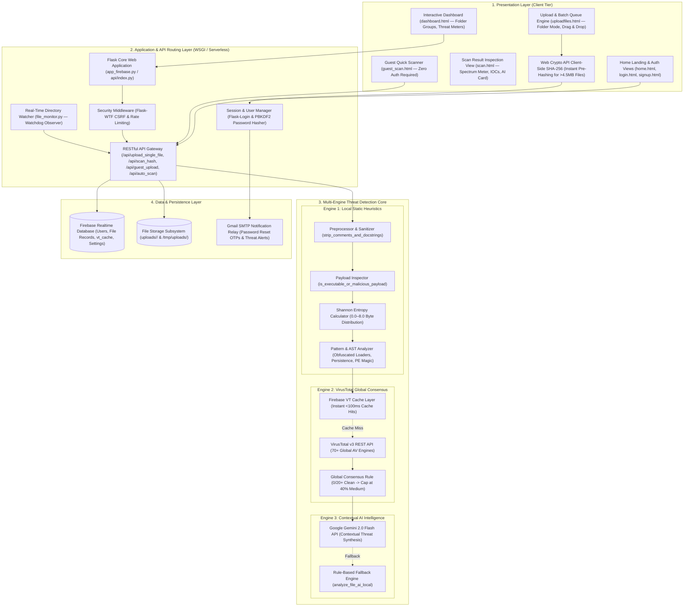
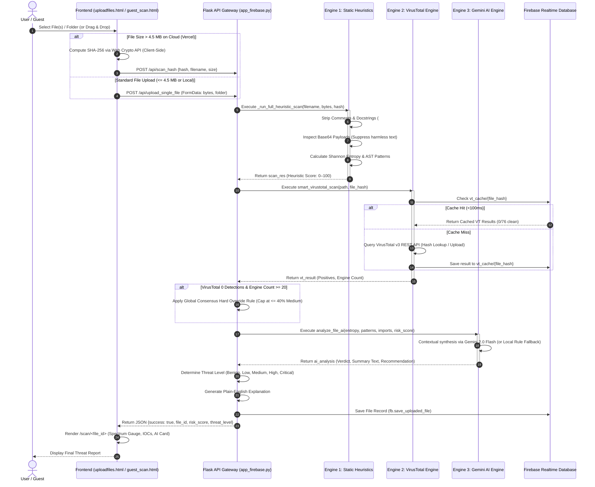

# TrustFile — Architecture, Workflow & Agile SDLC Diagrams

Comprehensive technical specification for the **TrustFile Malware Analysis & Security Monitoring System**.

---

## 1. System Architecture Diagram

---

## 2. System Workflow Diagram

---

## 3. Agile Methodology & SDLC Model Diagram

```mermaid
graph LR
    subgraph Backlog_Phase["1. Backlog & Requirements"]
        PB["Product Backlog<br/>(Security Features, False-Positive Rules)"]
        SP["Sprint Planning<br/>(Task Prioritization, Risk Assessment)"]
    end

    subgraph Sprint_Execution["2. Sprint Execution (1–2 Weeks)"]
        Code["Feature Development<br/>(Static AST Engine, VT Logic, Flask APIs)"]
        Pair["Pair Programming & AI Assistance<br/>(Antigravity Agentic Pair Coding)"]
        UnitTest["Local Unit & Parity Testing<br/>(test_enhancements.py, test_guest_parity.py)"]
    end

    subgraph CI_CD["3. Continuous Integration & Deployment"]
        GitPush["Git Commit & Branch Sync<br/>(origin/main)"]
        VercelBuild["Vercel Cloud Build<br/>(Python 3.12, uv, Serverless Bundling)"]
        ProdDeploy["Production Staging & Release<br/>(trustfile-tau-alpha.vercel.app)"]
    end

    subgraph Review_Feedback["4. Review & Retrospective"]
        SecAudit["Security & Accuracy Audit<br/>(False Positive Verification, Parity Check)"]
        SprintReview["Sprint Review & Demo<br/>(User Acceptance & Dashboard Validation)"]
        Retro["Sprint Retrospective<br/>(Engine Rule Refinement & Continuous Learning)"]
    end

    PB --> SP
    SP --> Code
    Code --> Pair
    Pair --> UnitTest
    UnitTest --> GitPush
    GitPush --> VercelBuild
    VercelBuild --> ProdDeploy
    ProdDeploy --> SecAudit
    SecAudit --> SprintReview
    SprintReview --> Retro
    Retro -->|Continuous Feedback Loop| PB
```

